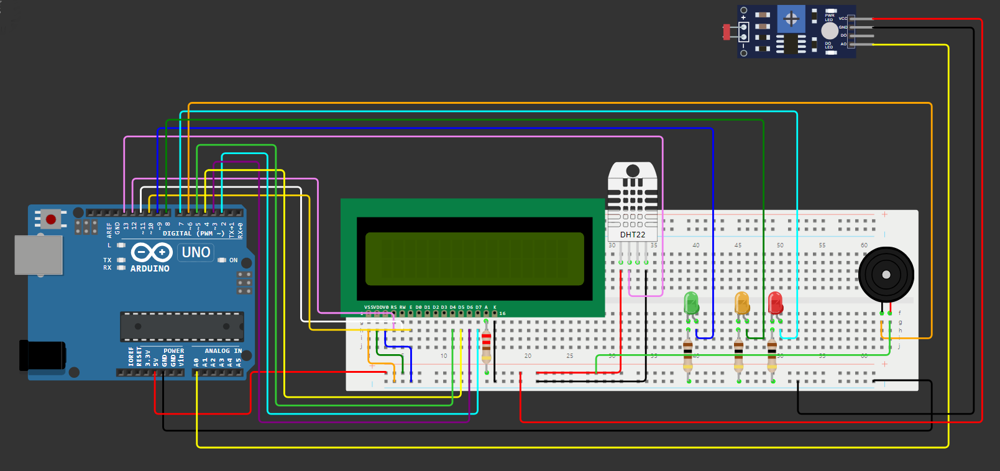
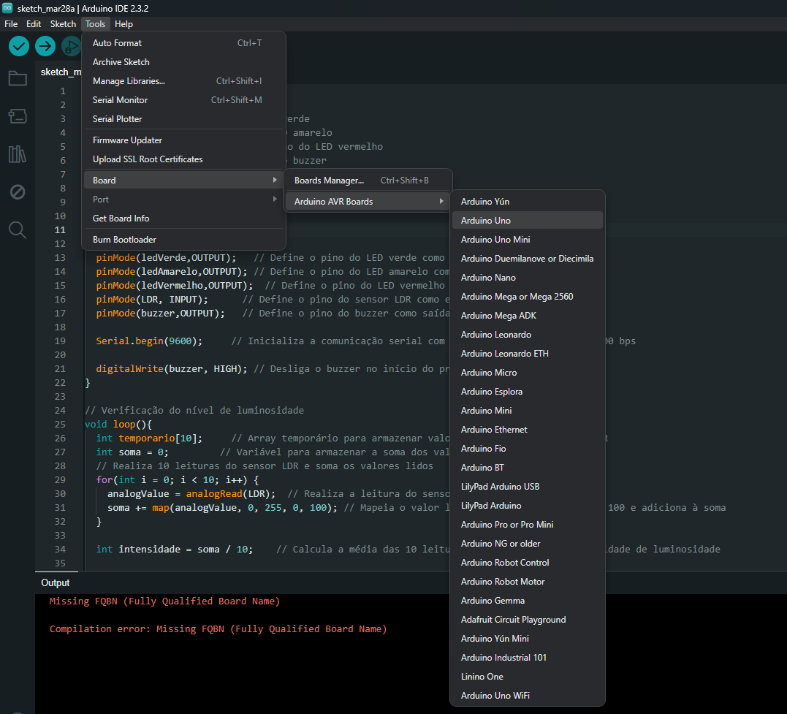
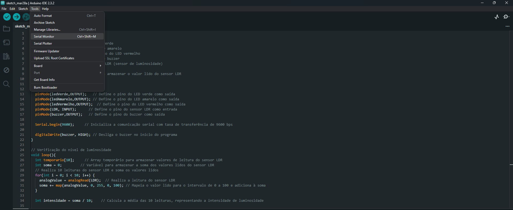

# CHECKPOINT 1 EDGE COMPUTING - O CASO DA VINHERIA AGNELLO
## Grupo:
* Glauco Heitor Gonçalves e Silva
* Lucas Himeno do Carmo
* Victor Hugo de Paula
* Otavio Santos de Lima Ferrao

## Descrição: 
Sistema de monitoramento do nível de luminosidade do ambiente.
<body>

## Índice
- <a href="#funcionalidades">Funcionalidades</a>
- <a href="#simulação">Simulação</a>
- <a href="#materiais">Materiais</a>
- <a href="#rodar">Como reproduzi-lo</a>
- <a href="#video">Vídeo do projeto</a>

## Funcionalidades

O sistema é capaz de indicar o estado do ambiente de acordo com os seguintes critérios de luminosidade:
* Verde: Quando a luminosidade está dentro dos parâmetros adequados, o LED verde é acionado, indicando que não há comprometimento da qualidade do vinho.
* Amarelo: Se a luminosidade excede um limite pré-estabelecido, o LED amarelo é acionado, indicando um nível de alerta e possível risco para o produto.
* Vermelho: Em caso de luminosidade excessiva, o LED vermelho é ativado e um aviso sonoro é emitido até que as condições ideais de armazenamento do vinho sejam restauradas.

## Simulação
* [Link da simulação](https://www.tinkercad.com/things/0eyZXIMSn9e-checkpoint-1-edge) 👈


## Materiais 
</ol>
    <li> 1 placa de ensaio
    <li> 1 cabo USB 2.0 A/B
    <li> Cabos jumper macho/macho
    <li> 1 LED difuso vermelho
    <li> 1 LED difuso verde
    <li> 1 LED difuso amarelo
    <li> 1 piezo buzzer 5V
    <li> 3 resistores de 100Ω
    <li> 1 fotoresistor LDR
    <li> 1 arduino UNO R3
    <li> 1 resistor de 200Ω
</ol>

## Como reproduzi-lo

<strong>1- Instale o programa Arduino IDE 
* [Link para download](https://support.arduino.cc/hc/en-us/articles/360019833020-Download-and-install-Arduino-IDE) 👈

<hr>

<strong>2- Selecione os materiais e conecte-os na placa de ensaio da mesma forma que a imagem abaixo: <strong>



<hr>

<strong>3- Conecte o cabo USB 2.0 A/B no arduino e o USB no computador/notebook. Um LED acenderá, informando que o arduino está ligado.

<hr>

<strong>4- Entre no programa, clique em ferramentas, selecione o tipo de arduino e veja se o computador o reconheceu, logo abaixo em porta.


<strong>5- Crie um novo arquivo e cole o código:

```
// Identificação das portas
int ledVerde = 4;		// Pino do LED verde
int ledAmarelo = 3;		// Pino do LED amarelo
int ledVermelho = 2;	        // Pino do LED vermelho
int buzzer = 5;		        // Pino do buzzer
int LDR = A0;			// Pino do sensor LDR (sensor de luminosidade)
	
int analogValue;		// Variável para armazenar o valor lido do sensor LDR

// Configurações iniciais
void setup() {
  pinMode(ledVerde,OUTPUT);		// Define o pino do LED verde como saída
  pinMode(ledAmarelo,OUTPUT);	// Define o pino do LED amarelo como saída
  pinMode(ledVermelho,OUTPUT);	// Define o pino do LED vermelho como saída
  pinMode(LDR, INPUT);			// Define o pino do sensor LDR como entrada
  pinMode(buzzer,OUTPUT);		// Define o pino do buzzer como saída

  Serial.begin(9600);			// Inicializa a comunicação serial com taxa de transferência de 9600 bps
  
  digitalWrite(buzzer, HIGH);	// Desliga o buzzer no início do programa
}

// Verificação do nível de luminosidade
void loop(){
  int temporario[10];			// Array temporário para armazenar valores de leitura do sensor LDR
  int soma = 0;					// Variável para armazenar a soma dos valores lidos do sensor LDR
  // Realiza 10 leituras do sensor LDR e soma os valores lidos
  for(int i = 0; i < 10; i++) {
    analogValue = analogRead(LDR);	// Realiza a leitura do sensor LDR
    soma += map(analogValue, 0, 255, 0, 100);	// Mapeia o valor lido para o intervalo de 0 a 100 e adiciona à soma  
  }

  int intensidade = soma / 10;		// Calcula a média das 10 leituras, representando a intensidade de luminosidade
  
 
  Serial.println(intensidade);		// Imprime a intensidade de luminosidade no monitor serial
  
  // Verifica a intensidade de luminosidade e ativa os LEDs e o buzzer de acordo com a necessidade
  if(intensidade < 60){  // Se a intensidade for menor que 60 (Baixa luminosidade - Ambiente adequado)
    digitalWrite(ledVerde, HIGH);	// Acende o LED verde
  }
  else if(intensidade >= 60 && intensidade <= 90){  // Se a intensidade estiver entre 60 e 90 (Luminosidade em nível de alerta)
    digitalWrite(ledAmarelo, HIGH);	// Acende o LED amarelo
  }
  else{   // Se a intensidade for maior que 90 (Alta luminosidade - Indicação de que há um problema)
    digitalWrite(ledVermelho, HIGH);// Acende o LED vermelho
    digitalWrite(buzzer, LOW);		// Liga o buzzer para indicar o problema
  }
  
  delay(3000);
  digitalWrite(ledVerde, LOW);	// Aguarda 3 segundos antes de reiniciar o loop
  // Desliga todos os LEDs e o buzzer antes de reiniciar o loop
  digitalWrite(ledAmarelo, LOW);
  digitalWrite(ledVermelho, LOW);
  digitalWrite(buzzer, HIGH);
}

```

<hr>

<strong>6- Após colado, clique na seta para enviar o código.

<hr>

<strong>7- Por fim, aguarde a compilação e envio do programa, depois abra o monitor serial para acompanhar o processo de leitura e ajuste os valores do código com base nesses valores.


## Vídeo do projeto
* [Link para o vídeo](https://youtu.be/z8XVtikej6I) 👈

<strong>

</body>
