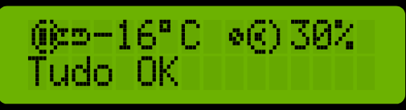
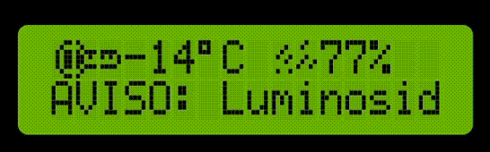
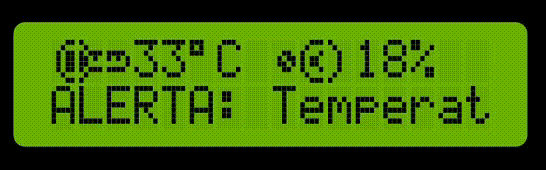

# MONITORAMENTO AMBIENTAL COM ARDUINO

## Grupo ARES:
* Glauco Heitor Gonçalves e Silva
* Lucas Himeno do Carmo
* Victor Hugo de Paula
* Otávio Santos de Lima Ferrao
* Gabriel Guilherme Leste

## Descrição: 
Sistema de monitoramento dos níveis de luminosidade, temperatura e umidade do ambiente.

## Índice:
- <a href="#funcionalidades">Funcionalidades</a>
- <a href="#simulação">Simulação</a>
- <a href="#hardware">Hardware necessário</a>
- <a href="#bibliotecas">Bibliotecas necessárias</a>
- <a href="#reproduzir">Como reproduzir</a>
- <a href="#contribuicao">Contribuição</a>
- <a href="#agradecimentos">Agradecimentos</a>
- <a href="#faq">FAQ</a>
- <a href="#suporte">Suporte</a>
- <a href="#roadmap">Roadmap</a>
- <a href="#versoes">Histórico de versões</a>

<h2 id="funcionalidades">Funcionalidades:</h2>

O sistema é capaz de indicar o estado do ambiente de acordo com os seguintes critérios de luminosidade, temperatura e umidade:
* Verde: Quando todas estas medidas estão dentro dos parâmetros adequados, o LED verde é acionado, além da mensagem no display, indicando que tudo está OK.   
* Amarelo: Se alguma das medidas excede um limite pré-estabelecido, o LED amarelo é acionado, uma mensagem no display informa qual é o parâmetro comprometido e o buzzer realiza um som periódico para alertar os operadores do sistema de que algo está errado.   
* Vermelho: Caso um ou mais parâmetros estejam em nível de alerta, o LED vermelho é ativado, uma mensagem no display informa qual o problema e o aviso sonoro é emitido com maior frequência até que as condições ideais sejam restauradas.   

<h2 id="simulacao">Simulação:</h2>

* [Link da simulação](https://wokwi.com/projects/396447665100950529) 👈

<h2 id="hardware">Hardware necessário:</h2>

- Arduino Uno R3 (ou similar)
- Sensor de temperatura e umidade DHT22 (ou DHT11)
- Fotoresistor (LDR)
- Display LCD 16x2
- LEDs (vermelho, amarelo, verde)
- Buzzer
- 1 resistor 220 Ω
- 3 resistores 100 Ω
- Cabos jumper macho/macho e macho/fêmea
- Placa de ensaio
- Cabo USB 2.0 A/B

<h2 id="bibliotecas">Bibliotecas necessárias:</h2>

- DHT sensor library (para o sensor DHT22 ou DHT11)
- LiquidCrystal (para o display LCD)

<h2 id="reproduzir">Como reproduzir:</h2>

### 1 - Instale o programa Arduino IDE
- [Link para download](https://support.arduino.cc/hc/en-us/articles/360019833020-Download-and-install-Arduino-IDE) 👈

#### 2 - Conecte os componentes conforme o esquema abaixo: <strong>

#### 3 - Conecte o cabo USB 2.0 A/B no arduino e o USB no computador/notebook. Um LED acenderá, informando que o arduino está ligado.

#### 4 - Entre no programa, clique em ferramentas, selecione o tipo de arduino e veja se o computador o reconheceu, logo abaixo em "Port".

#### 5 - Crie um novo arquivo e cole o código:
- [Código](./codigo.ino)

#### 6 - Após colado, certifique-se de instalar as bibliotecas referenciadas no começo do documento e clique na seta para enviar o código.

#### 7 - Aguarde a compilação e envio do programa.

<h2 id="contribuicao">Contribuição:</h2>

Contribuições são bem-vindas! Sinta-se à vontade para abrir problemas ou enviar solicitações de pull.

<h2 id="agradecimentos">Agradecimentos:</h2>

Agradecemos ao professor Cabrini pelo suporte e orientação.

<h2 id="faq">FAQ:</h2>

### P: Posso usar outro tipo de sensor de temperatura?
R: Sim, você pode modificar o código para usar outros sensores compatíveis com o Arduino.

### P: Como posso ajustar os limites de alerta?
R: Você pode alterar os valores das variáveis `lightAlert`, `humAlert` e `tempAlert` no código para ajustar os limiares de alerta conforme necessário.

### P: Qual foi o método de leitura dos sensores utilizados?
R: Utilizamos uma média móvel de 10 leituras para evitar picos aleatórios e suavizar as variações entre as leituras.

<h2 id="suporte">Suporte:</h2>

Se você tiver dúvidas ou encontrar problemas, entre em contato através do email gabrielgleste@gmail.com.

<h2 id="roadmap">Roadmap:</h2>

- Adicionar suporte para outros tipos de sensores de temperatura e umidade.
- Implementar uma interface de usuário mais interativa.
- Expandir os recursos de monitoramento para incluir mais parâmetros ambientais.

<h2 id="versoes">Histórico de versões:</h2>

- **v1.0.0** (01/04/2024): LEDs e Buzina, medida apenas da Luminosidade.
- **v2.0.0** (28/04/2024): Introduzindo o Display, medidas da Temperatura, Umidade e Luminosidade.
